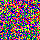
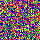

# gosom

[](https://godoc.org/github.com/milosgajdos/gosom)
[](https://opensource.org/licenses/Apache-2.0)
[](https://travis-ci.org/milosgajdos/gosom)
[](https://goreportcard.com/report/github.com/milosgajdos/gosom)

This project provides an implementation of [Self-Organizing Map](https://en.wikipedia.org/wiki/Self-organizing_map) (SOM) in Go. It implements the two most well known SOM training algorithms: `sequential` and `batch`. The `batch` training is faster than the `sequential` as it can be parallelized, taking advantage of as many cores as your machine provides. However it can be less accurate as it merely provides a resonable approximation of SOM, but still acceptable. The `sequential` algorithm is performed as its name implies, sequentially. Because of its sequential nature it's slower than `batch` training, but more accurate. You can read more about SOM training algorithms [here](http://www.scholarpedia.org/article/Kohonen_network).

The goal of this project is to provide an API to build SOMs in `Go`. The project also implements various SOM quality measures which can help you validate the results of the training algorithm. In particular the project implements `quantization` and `topographic` error to measure both the projection and topography as well as `topographic product` which can help you make a decision about the size of the SOM grid.

See the accompanying introductory [blog post](http://mlexplore.org/2017/01/13/self-organizing-maps-in-go/).

# Get started

Get the source code:

```
$ go get -u github.com/milosgajdos/gosom
```

**Make sure you've got all the dependencies** (`go get -u` should retrieve them, but this project might use a specific version of `gonum` so make sure you run the following command):

```
$ make dep
```

Run the tests:

```
$ make test
```

# Example

You can see the simplest example of `SOM` below:

```go
func main() {
        // make random data
        d := []float64{5.1, 3.5, 1.4, 0.1,
                4.9, 3.0, 1.4, 0.2,
                4.7, 3.2, 1.3, 0.3,
                4.6, 3.1, 1.5, 0.4,
                5.0, 3.6, 1.4, 0.5}
        data := mat64.NewDense(5, 4, d)
        // SOM configuration
        grid := &som.GridConfig{
                Size:   []int{2, 2},
                Type:   "planar",
                UShape: "hexagon",
        }
        cb := &som.CbConfig{
                Dim:      4,
                InitFunc: som.RandInit,
        }
        mapCfg := &som.MapConfig{
                Grid: grid,
                Cb:   cb,
        }
        // create new SOM
        m, err := som.NewMap(mapCfg, data)
        if err != nil {
                fmt.Fprintf(os.Stderr, "\nERROR: %s\n", err)
                os.Exit(1)
        }
        // training configuration
        trainCfg := &som.TrainConfig{
                Algorithm: "seq",
                Radius:    500.0,
                RDecay:    "exp",
                NeighbFn:  som.Gaussian,
                LRate:     0.5,
                LDecay:    "exp",
        }
        if err := m.Train(trainCfg, data, 300); err != nil {
                fmt.Fprintf(os.Stderr, "\nERROR: %s\n", err)
                os.Exit(1)
        }
        // check quantization error
        qe, err := m.QuantError(data)
        if err != nil {
                fmt.Fprintf(os.Stderr, "\nERROR: %s\n", err)
                os.Exit(1)
        }
        log.Printf("Quantization Error: %f\n", qe)
}
```

If you build and run this program it will spit out `quantization` error. It's not that particularly exciting. You could generate a `u-matrix`, but since the data set is very simple, it would not be particularly interesting either. If you want to see more elaboarate and moreinteresting stuff you can do, check out the samples programs in `examples` directory.

# Clustering

SOMs are a very good tool to perform data clustering. Examples directory contains two more elaborate programs that illustrate the power of SOM clustering.

## Colors example

A classic "schoolbook" example of self-organisation is clustering of colors in arbitrarily "nosiy" images. You can find a simple program which does this in the `colors` subdirectory of `examples`. When you build the program you can run it as follows:

```
$ make colors
$ ./_build/colors -umatrix umatrix.html -dims 40,40 -radius 500.0 -rdecay exp -lrate 0.5 -ldecay exp -ushape hexagon -iters 30000 -training seq -input ./examples/colors/testdata/colors.png -output som.png
[ gosom ] Loading data set ./examples/colors/testdata/colors.png
[ gosom ] Creating new SOM. Dimensions: [40 40], Grid Type: planar, Unit shape: hexagon
[ gosom ] Starting SOM training. Method: seq, iterations: 30000
[ gosom ] Training successfully completed. Duration: 3.843383347s
[ gosom ] Saving U-Matrix to umatrix.html
```

This program reads in a sample "noisy" image (each pixel has a random pixel value assigned from Uniform distribution `[0,255]`). The training then "organizes" the input values into SOM model (aka codebook) vectors. You can see the results of the training below along with a simple capture of the training process:

<p float="left">



</p>

## Arbitrary labeled data

Even more elaborate example can be found in `fpcs` directory. It is used to demostrate that both implemented algorithm behave as expected according to the following [research](http://www.uni-marburg.de/fb12/arbeitsgruppen/datenbionik/data?language_sync=1). You can verify this yourself. First you have to build the `fcps` example program:

```
$ make fcps
```

The program provides various cli options:

```
$ ./_build/fcps -h
```

Examples of both `batch` and `sequential` training runs can be found below:

### Batch algorithm

```
$ D=Target ./_build/fcps -umatrix umatrix_batch.html -dims 30,30 -radius 500.0 -rdecay exp -ushape rectangle -iters 100 -training batch -input examples/fcps/testdata/fcps/${D}.lrn -cls examples/fcps/testdata/fcps/${D}.cls
[ gosom ] Loading data set testdata/fcps/Target.lrn
[ gosom ] Creating new SOM. Dimensions: [30 30], Grid: planar, Unit shape: rectangle
[ gosom ] Starting SOM training. Method: batch, iterations: 100
[ gosom ] Training successfully completed. Duration: 1.923548243s
[ gosom ] Saving U-Matrix to umatrix_batch.html
[ gosom ] Quantization Error: 0.023212
[ gosom ] Topographic Product: +Inf
[ gosom ] Topographic Error: 0.015584
```

### Sequential algorithm

```
$ D=Target ./_build/fcps -umatrix umatrix_seq.html -dims 30,30 -radius 500.0 -rdecay exp -lrate 0.5 -ldecay exp -ushape hexagon -iters 30000 -training seq -input examples/fcps/testdata/fcps/${D}.lrn -cls examples/fcps/testdata/fcps/${D}.cls
[ gosom ] Loading data set testdata/fcps/Target.lrn
[ gosom ] Creating new SOM. Dimensions: [30 30], Grid: planar, Unit shape: hexagon
[ gosom ] Starting SOM training. Method: seq, iterations: 30000
[ gosom ] Training successfully completed. Duration: 2.261068582s
[ gosom ] Saving U-Matrix to umatrix_seq.html
[ gosom ] Quantization Error: 0.064704
[ gosom ] Topographic Product: 0.010281
[ gosom ] Topographic Error: 0.014286
```

### Results

Both of the above mentioned runs generate a simple `umatrix` that displays the clustered data in `svg` format. You can now inspect the files to cmpare the both algorithms.

# Acknowledgements

Test data present in `fcps` subdirectory of `testdata` come from [Philipps University of Marburg](http://www.uni-marburg.de/fb12/arbeitsgruppen/datenbionik/data?language_sync=1):

**Ultsch, A.**: Clustering with SOM: U*C, In *Proc. Workshop on Self-Organizing Maps, Paris, France, (2005) , pp. 75-82*
